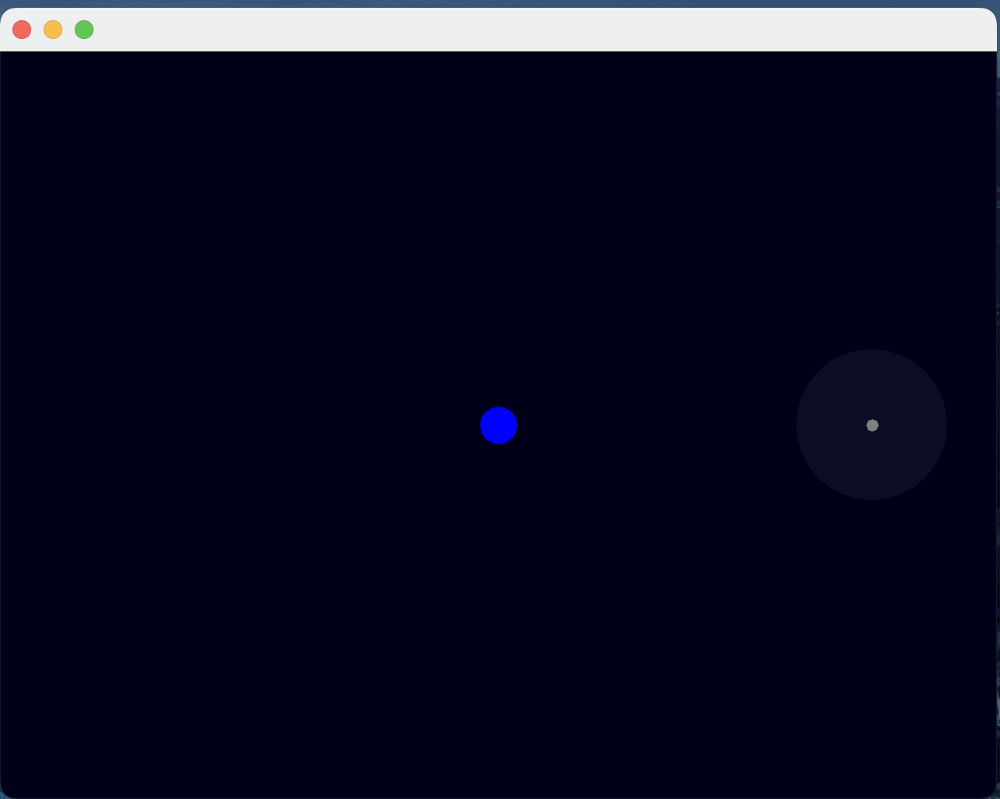

# scala drawing project
  experimenting with scala ui stuff

## details

### ksp orbit stuff
* kinda vaguely did some things
* would need adjustable scale
* probably should move to using doubles instead of floats

* maybe should have csv for celestial body information

## ideas
1. tree for planets relations
    * would need a tree structure for orbitting what body
    * maybe have there's parent of celestial body, but you have planet or moon or star or solarcenter
2. syntax tree for the planet arrangement?
    * syntax parsing/translating for the arrangement of the bodies?
    * have it then translate to orbits and positioning based on pre-defined default rules
3. what if shuffling celestial bodies
    * while using the syntax tree we could just shuffle the orders of the pieces by rules
4. wave function collapse style generation
    * would be more accurate to real life, bc then each body `soiFootprint <= availableFootprint`
    * could pull a fragmentation memory??
5. indexed body data
    * key for body data
    * translate into the space
    * shuffling keys/URIs
6. generation of new bodies
    * needs math of how the things behave
    * can then perlin noise the terrain?
    * inter-meshed height maps like townscaper grids?
    * procedural grid changes
    * syntax of body to terrain profiles to clutters?
    * a grammar for the generation
7. grammar all the things
    * turn it all into grammars, then it's just a syntax parsing away
    * then you can syntax tree
    * translating into code 
    * transferable without future proofing
    * scaleable for new features
    * more overhead though
8. generation settings
    * base on how much of a percentage of RNG building / existing library selections
    * 
